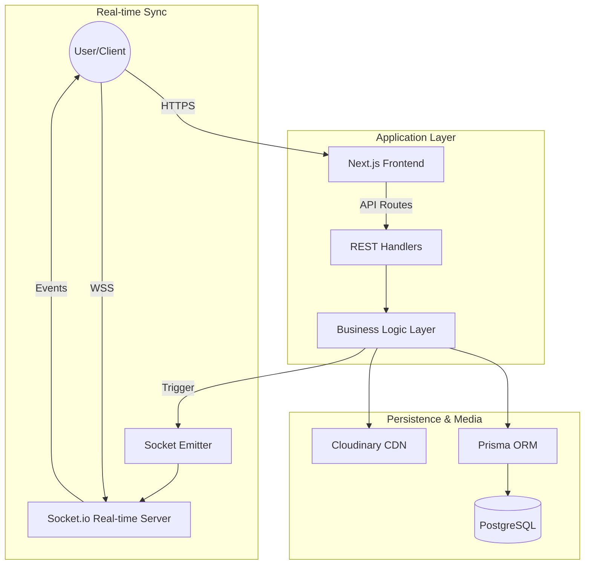

## TaskFlow | Architecture & System Design

## 1. Project Title
**TaskFlow: Scalable Enterprise Task Orchestration Platform**

---

## 2. Introduction
Welcome to the official architecture documentation for **TaskFlow**. TaskFlow is a high-performance, real-time task management and project orchestration platform designed to streamline collaboration for modern teams.

> [!IMPORTANT]
> This repository is dedicated exclusively to the **system architecture, design patterns, and infrastructure specifications** of the TaskFlow platform. The production source code is maintained in a private repository for security and intellectual property reasons.

---

## 3. System Overview
### Purpose
The platform addresses the complexities of multi-tenant project management, providing a unified workspace for organizations to track progress, manage resources, and maintain real-time synchronization across distributed teams.

### Core Capabilities
*   **Hierarchical Management**: Multi-level nesting from Organizations to Companies, Projects, and Tasks.
*   **Real-Time Synchronization**: Sub-50ms latency in state updates across all connected clients.
*   **Granular RBAC**: Role-Based Access Control allowing fine-grained permissions for Admins, Managers, Team Leads, and Employees.
*   **Auditability**: Comprehensive activity logging and notification systems for all state transitions.

### Operational Workflow
Users interact with a React-based frontend that communicates with a decoupled backend. Business logic is executed in a stateless service layer, while real-time events are dispatched via a dedicated WebSocket cluster.

---

## 4. Architecture Overview

### High-Level Diagram

*   **Client Layer**: A responsive PWA built with React, leveraging Tailwind CSS for Atomic CSS architecture.
*   **Frontend Application**: Next.js App Router utilizing Server Components for performance and Client Components for interactivity.
*   **Backend API Layer**: RESTful API endpoints hosted as serverless functions, ensuring high availability.
*   **Caching Layer**: Implementation of Next.js Data Cache and stale-while-revalidate (SWR) patterns for optimized data fetching.
*   **Database Layer**: Normalized PostgreSQL schema managed via Prisma ORM for type-safe data access.
*   **Background Workers**: Asynchronous processing for email notifications and complex activity log aggregation.

---

## 5. Technology Stack

### Frontend
*   **Framework**: Next.js 15 (App Router)
*   **Library**: React 19
*   **Styling**: Tailwind CSS 4, Framer Motion (Animations)
*   **Icons**: Lucide React

### Backend
*   **Runtime**: Node.js
*   **Real-time**: Socket.io
*   **Validation**: Zod (Schema Validation)
*   **Logging**: Pino / Pino-pretty

### Database & Storage
*   **Primary DB**: PostgreSQL
*   **ORM**: Prisma
*   **Media**: Cloudinary (Asset Storage)

### Infrastructure & DevOps
*   **Hosting**: Vercel (Frontend/API), Render (Socket Server)
*   **Security**: NextAuth.js (Auth), Bcryptjs (Hashing)
*   **CI/CD**: GitHub Actions

---

## 6. System Components

*   **User Interface**: A modular system of shadcn/ui components optimized for accessibility and performance.
*   **API Services**: Twelve+ specialized services (Project, Task, Auth, etc.) that encapsulate all domain-specific logic.
*   **Data Storage**: A robust schema designed for relational integrity, featuring Cascading deletes and soft-delete capabilities.
*   **Authentication Layer**: Secure session-based authentication with protected route middleware and JWT support.
*   **Messaging System**: A dedicated WebSocket server handling event broadcasting for task movements, status updates, and mentions.

---

## 7. Backend Architecture

The backend follows a **Clean Architecture** approach, separating concerns into distinct layers:

1.  **Routing**: Next.js App Router defining the API surface area.
2.  **Middleware**: Global interceptors for authentication, rate-limiting, and error transformation.
3.  **Controllers**: Interface between the HTTP request and the internal services.
4.  **Services**: The "Brain" of the application where business rules are enforced (e.g., ensuring a user cannot assign a task to a non-member).
5.  **Utilities**: Shared helpers for formatting, logging, and external API integrations.
6.  **Configuration**: Strongly-typed environment management via `.env` files and runtime validation.

---

## 8. Database Design (Conceptual)

The data model is designed for strict relational integrity and scalability.

| Entity | Purpose | Key Relationships |
| :--- | :--- | :--- |
| **User** | Identity management | Owns Orgs, Assigned to Tasks |
| **Organization** | Highest level tenant | Contains Companies, Members |
| **Project** | Container for work | Belong to Company, Contains Tasks |
| **Task** | Atomic unit of work | Assigned to User, Contains Subtasks |
| **ActivityLog** | Audit trail | Relates to User, Project, and Task |
| **Subscription** | Monetization layer | Relates to Organization |

---

## 9. Performance & Scalability Considerations

*   **Optimized Queries**: All database queries are indexed on `cuid` fields and frequently filtered columns like `status` and `projectId`.
*   **Horizontal Scaling**: The stateless nature of the Next.js API allows handles traffic spikes by scaling serverless instances.
*   **Real-time Optimization**: Socket.io namespaces and rooms are used to ensure users only receive updates pertinent to their active projects.
*   **Static Rendering**: Non-sensitive pages (like landing and documentation) use ISR (Incremental Static Regeneration) for near-instant load times.

---

## 10. Security Considerations

*   **Authentication**: Credentials-based login with industry-standard Bcrypt hashing.
*   **Role-Based Access (RBAC)**: Middleware strictly enforces that actions like `DELETE_PROJECT` are only available to `ADMIN` or `MANAGER` roles.
*   **Data Sanitization**: Zod-based validation prevents SQL injection and ensures type safety from the API edge to the database.
*   **Infrastructure Security**: Use of environment secrets, HTTPS/WSS enforcement, and CORS policy hardening.

---

## 11. DevOps & Deployment

*   **Build Pipeline**: Automated TypeScript transpilation and Prisma client generation.
*   **Deployment**: Continuous Deployment to Vercel (Edge) and Render (WebSockets) via GitHub hooks.
*   **Migrations**: Prisma Migrate handles version-controlled database schema changes safely.
*   **Monitoring**: Integrated logging for real-time error tracking and performance metrics.

---

## 12. Repository Scope

This repository specifically contains:
*   ✅ Comprehensive Architecture Documentation
*   ✅ Conceptual Schema Diagrams
*   ✅ Infrastructure Configuration Blueprints
*   ✅ Design Patterns and Best Practices

*   ❌ **No Production Source Code**
*   ❌ **No Private Secrets or Keys**
*   ❌ **No Customer Data**

---

## 13. Disclaimer

> [!CAUTION]
> The production codebase of TaskFlow is a proprietary software asset and is not included in this repository. Any attempt to reverse-engineer or replicate the system based on these architectural docs should respect the copyright and intellectual property rights of the owners.
